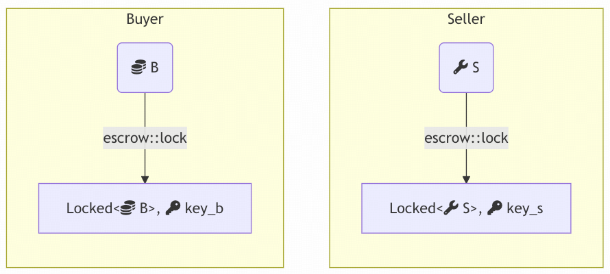
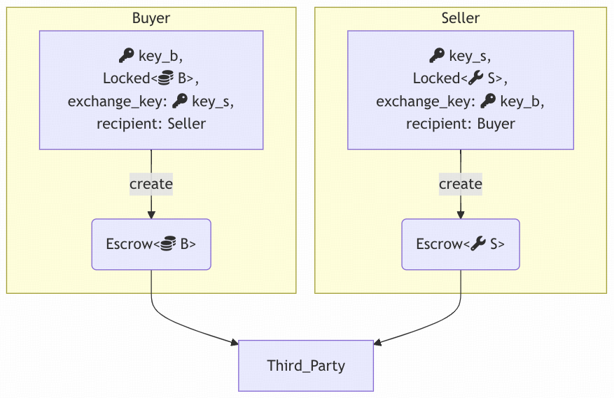
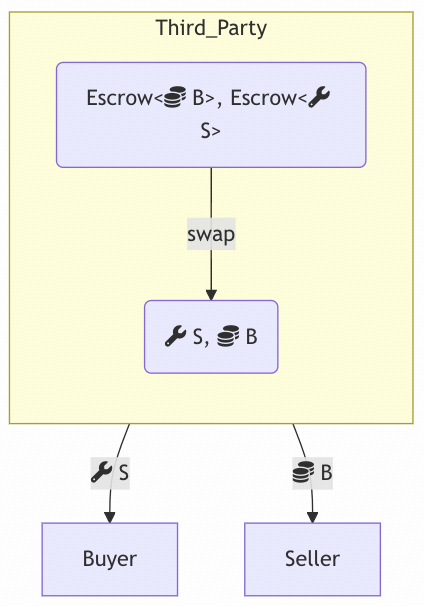
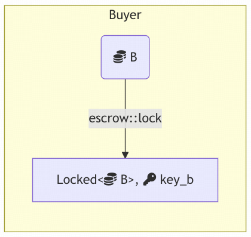
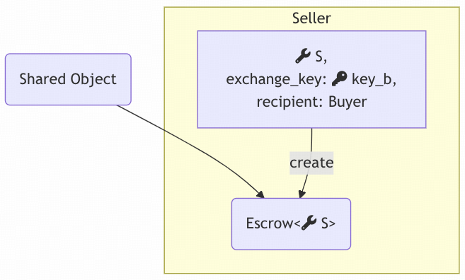
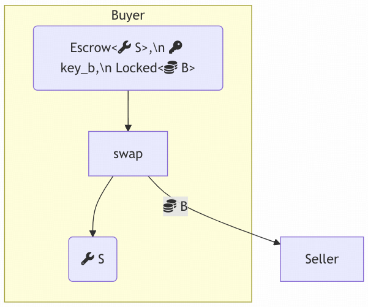

# 对象所有权基础


## 基础知识 

Demo源码：https://github.com/MystenLabs/sui/tree/main/examples/trading/contracts/escrow

在 Sui 链上，对象可以通过两种方式进行版本控制：**快速路径（fastpath）或共识路径（consensus）**这两种路径的选择影响对象的所有权选项，以及应用程序的性能和操作复杂性许多应用程序可以使用仅使用共识对象或仅使用快速路径对象的解决方案来构建，每种方法都有需要权衡的利弊

### 快速路径对象（Fastpath Objects）

快速路径对象必须由单个地址拥有（或为不可变）这使得编写需要多个参与方或节点访问同一对象的应用程序变得复杂对非常热门的快速路径对象的访问需要在链下进行协调然而，使用快速路径的事务受益于非常低的最终确定延迟

### 共识对象（Consensus Objects）

共识对象可以由单个地址拥有（称为 party 对象），也可以由任何事务全局可读写（称为 shared 对象）访问一个或多个共识对象的事务需要通过共识来排序对这些对象的读写操作这使得版本管理变得更简单，尤其是对于访问频繁的对象，但会导致稍高的 gas 成本和延迟

访问多个共识对象或特别热门的对象的事务，可能由于争用而增加延迟然而，使用共识对象的优势在于允许多个地址以协调的方式访问同一对象的灵活性

**总而言之：**

* **快速路径对象**：适用于对延迟或 gas 成本极为敏感、不需要处理复杂多方事务或已经需要链下服务的应用程序
* **共识对象**：适用于需要多个参与方协调的应用程序

如果您需要进一步了解 Sui 支持的对象类型，请参阅[《Object Ownership》](https://docs.sui.io/concepts/object-ownership)

---

## 示例：托管（Escrow） 

托管示例通过在两种风格中实现相同的应用程序，展示了共识对象和快速路径对象之间的权衡两种风格的示例都实现了一个服务，使两个地址之间的对象交换（“交易”）成为可能，服务将这些对象托管在中介处

### `Locked<T>` 和 `Key`

```move
module escrow::lock {
    public fun lock<T: store>(obj: T, ctx: &mut TxContext): (Locked<T>, Key);
    public fun unlock<T: store>(locked: Locked<T>, key: Key): T;
}
```

两种实现都使用了一种用于锁定值的原语，提供以下接口：
  * `lock`：将对象 `obj` 锁定，返回 `Locked<T>` 和 `Key`
  * `unlock`：使用 `Key` 解锁 `Locked<T>`，返回原始对象 `T`

任何具有 `store` 能力的类型 `T` 都可以被锁定，以获取 `Locked<T>` 和相应的 `Key`，反之亦然，锁定的值及其相应的键可以被消费，以获取回包装的对象

此接口提供的重要属性是，锁定的值在解锁之前不能被修改（并且在解锁后重新锁定）因为解锁会消耗密钥，所以可以通过记住锁定时使用的密钥 ID 来检测篡改这可以防止交换中的一方更改他们提供的对象以降低其价值

### 地址拥有的对象（fastpath） 

参考：[escrow/sources/owned.move](./sources/owned.move)

使用地址拥有对象实现的基于托管的交换协议，首先由双方锁定各自的对象开始：



这用于证明在交换协议达成后，对象没有被篡改
如果此时任意一方不想继续，他们只需解锁自己的对象即可。

假设双方都同意继续，下一步就是双方交换密钥。


第三方作为托管人托管人保存那些正在等待对应物到来的对象，当对应物到达时，就将它们配对，从而完成交换

参考：[escrow/sources/owned.move](./sources/owned.move)

```move
public fun create<T: key + store>(
    key: Key,
    locked: Locked<T>,
    exchange_key: ID,
    recipient: address,
    custodian: address,
    ctx: &mut TxContext,
) {
    let escrow = Escrow {
        id: object::new(ctx),
        sender: ctx.sender(),
        recipient,
        exchange_key,
        escrowed_key: object::id(&key),
        escrowed: locked.unlock(key),
    };

    transfer::transfer(escrow, custodian);
}
```



`create` 函数会准备托管（Escrow）请求，并将其发送给托管人由该参与方提供的对象会随同它的密钥一起传入并被锁定，而所请求的对象则通过它被锁定时所用密钥的 ID 来标识在准备请求的过程中，提供的对象会被解锁，同时会记住其密钥的 ID

虽然托管人被信任以保证活性（即：当它同时持有交换双方的对象时，能够完成交换；当被请求时，能够归还对象），但所有其他正确性属性都由 Move 保证：即使托管人同时拥有双方被交换的对象，他们唯一被允许执行的有效操作就是将其与正确的对应物配对以完成交换，或者将对象归还



```move
/// 托管人（受信任的第三方）执行双方之间交换的函数
/// 如果双方的发送者和接收者不匹配，或者双方各自期望的对象不匹配，则操作失败
public fun swap<T: key + store, U: key + store>(obj1: Escrow<T>, obj2: Escrow<U>) {
    let Escrow {
        id: id1,
        sender: sender1,
        recipient: recipient1,
        exchange_key: exchange_key1,
        escrowed_key: escrowed_key1,
        escrowed: escrowed1,
    } = obj1;

    let Escrow {
        id: id2,
        sender: sender2,
        recipient: recipient2,
        exchange_key: exchange_key2,
        escrowed_key: escrowed_key2,
        escrowed: escrowed2,
    } = obj2;
    id1.delete();
    id2.delete();

    // Make sure the sender and recipient match each other
    assert!(sender1 == recipient2, EMismatchedSenderRecipient);
    assert!(sender2 == recipient1, EMismatchedSenderRecipient);

    // Make sure the objects match each other and haven't been modified
    // (they remain locked).
    assert!(escrowed_key1 == exchange_key2, EMismatchedExchangeObject);
    assert!(escrowed_key2 == exchange_key1, EMismatchedExchangeObject);

    // Do the actual swap
    transfer::public_transfer(escrowed1, recipient1);
    transfer::public_transfer(escrowed2, recipient2);
}
```
`swap` 函数会检查发送方和接收方是否匹配，并且通过比较各自的密钥 ID，确认每一方确实想要对方所提供的对象如果托管人试图将两个互不相关的托管请求撮合在一起进行交换，那么交易将失败。


### 共享对象（consensus） 

参考：[escrow/sources/shared.move](./sources/shared.move)

在共享对象情况下的协议虽然对称性较弱，但仍然是由第一方先锁定他们想要交换的对象开始：



第二方随后可以查看已被锁定的对象，如果他决定想要与之交换，就通过创建一个 swap 请求来表明意向：



```move
public fun create<T: key + store>(
    escrowed: T,
    exchange_key: ID,
    recipient: address,
    ctx: &mut TxContext,
) {
    let mut escrow = Escrow<T> {
        id: object::new(ctx),
        sender: ctx.sender(),
        recipient,
        exchange_key,
    };
    event::emit(EscrowCreated {
        escrow_id: object::id(&escrow),
        key_id: exchange_key,
        sender: escrow.sender,
        recipient,
        item_id: object::id(&escrowed),
    });

    dof::add(&mut escrow.id, EscrowedObjectKey {}, escrowed);

    transfer::public_share_object(escrow);
}
```

这一次 `create` 请求直接接收被托管的对象（而不是锁定后的对象），并创建一个共享的 `Escrow` 对象该请求会记录发送它的地址（如果交换尚未发生，该地址有权取回对象），以及预期的接收方，接收方随后应当通过提供其最初锁定的对象来继续完成交换：



参考：[escrow/sources/shared.move](./sources/shared.move)
```move
/// `recipient` 可以用 `obj` 与托管对象进行交换
public fun swap<T: key + store, U: key + store>(
    mut escrow: Escrow<T>,
    key: Key,
    locked: Locked<U>,
    ctx: &TxContext,
): T {
    let escrowed = dof::remove<EscrowedObjectKey, T>(&mut escrow.id, EscrowedObjectKey {});

    let Escrow {
        id,
        sender,
        recipient,
        exchange_key,
    } = escrow;

    assert!(recipient == ctx.sender(), EMismatchedSenderRecipient);
    assert!(exchange_key == object::id(&key), EMismatchedExchangeObject);

    // Do the actual swap
    transfer::public_transfer(locked.unlock(key), sender);

    event::emit(EscrowSwapped {
        escrow_id: id.to_inner(),
    });

    id.delete();

    escrowed
}
```

尽管 `Escrow` 对象是一个共享对象，任何人都可以访问，但 Move 接口保证只有原始发送方和预期接收方才能成功与之交互`swap` 会检查锁定的对象是否与创建 `Escrow` 时请求的对象匹配（同样通过比较密钥 ID），并假设预期接收方确实想要该托管对象（如果不想要，他们就不会调用 `swap`）

假设所有检查都通过，`Escrow` 中持有的对象会被取出，其包装对象被删除，然后返回给第一方同时，第一方提供的被锁定对象也会被解锁并发送给第二方，从而完成交换

## 总结
本主题探讨了两种实现两个对象之间交换的方法在这两种情况下，都会出现一方发出请求而另一方尚未响应的情况此时，双方可能都想访问 `Escrow` 对象：一方是为了取消交换，另一方是为了完成交换。

* **第一种情况**：协议仅使用地址拥有对象，但需要托管人作为中介这样做的好处是完全避免了共识带来的成本和延迟，但步骤更多，并且需要信任第三方以保证活性（liveness）

* **另一种情况**：对象以共享对象形式在链上托管这需要共识机制，但步骤更少，并且不涉及第三方


